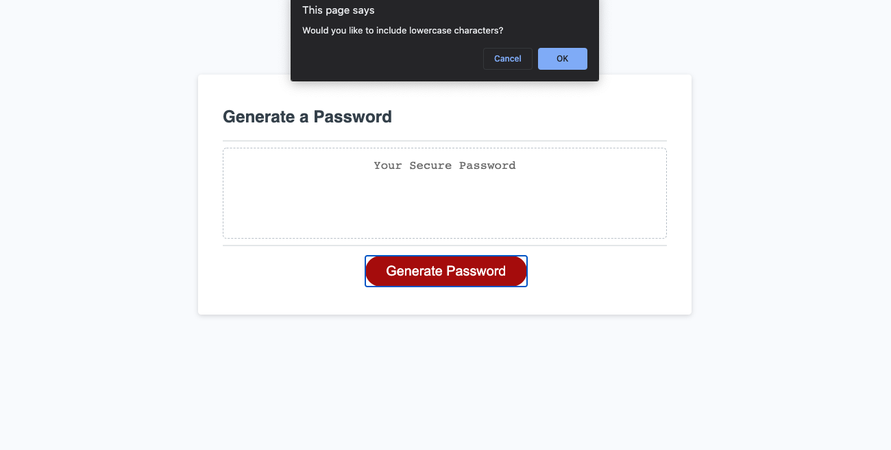
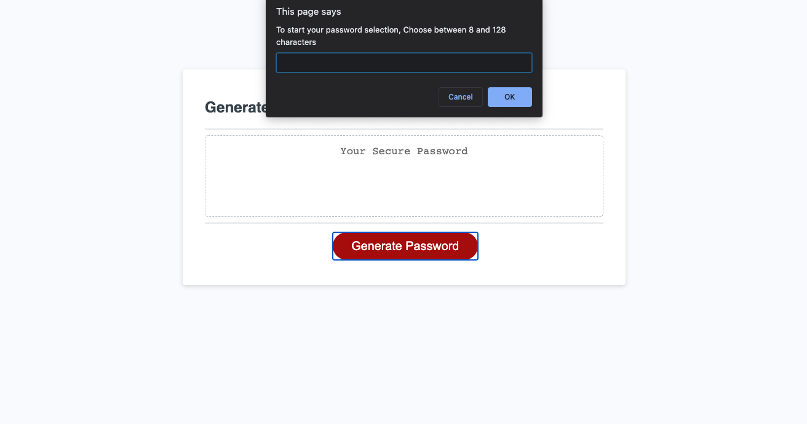
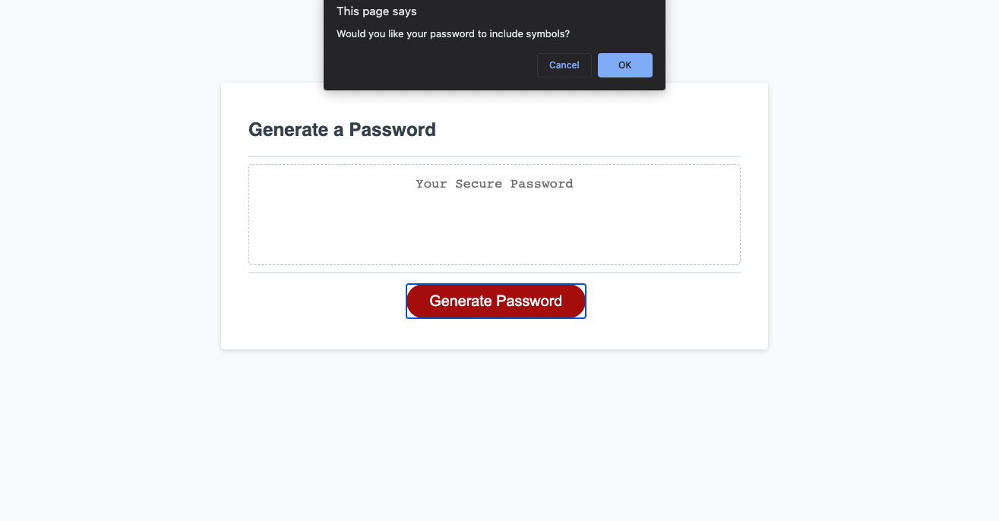
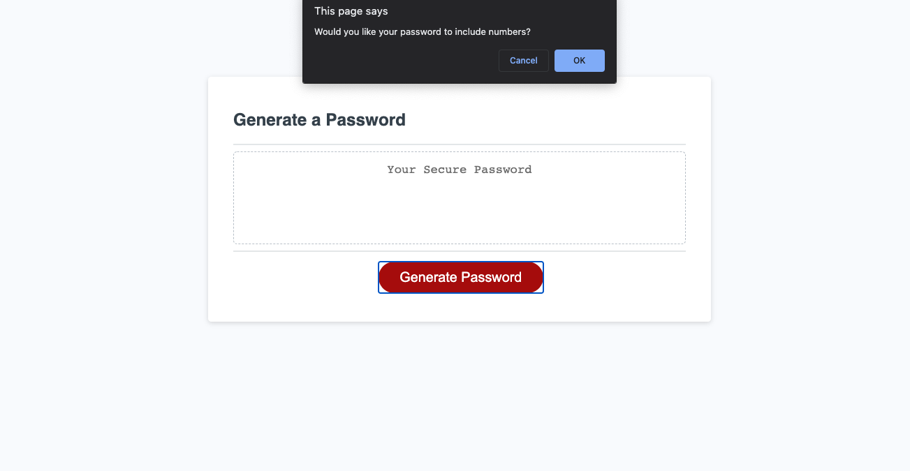
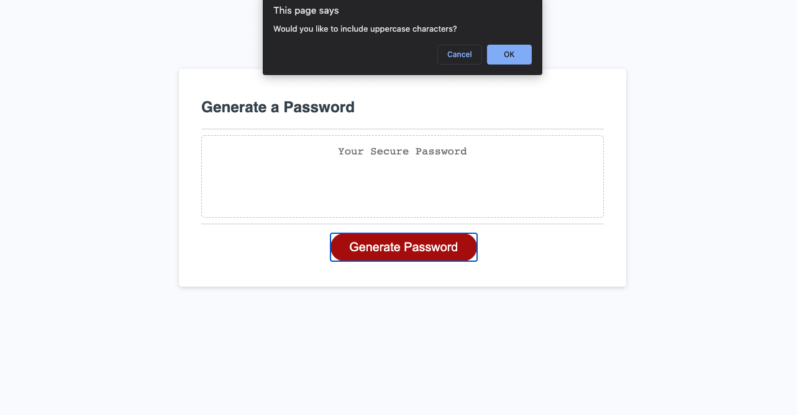

# password-generator
Generate a random password from user input 

1. Define character, numbers and symbols to be used in generating password. 
var charLower = ["a", "b", "c", "d", "e", "f", "g", "h", "i", "j", "k", "l", "m", "n", "o", "p", "q", "r", "s", "t", "u", "v", "w", "x", "y", "z"];
var charUpper = ["A", "B", "C", "D", "E", "F", "G", "H", "I", "J", "K", "L", "M", "N", "O", "P", "Q", "R", "S", "T", "U", "V", "W", "X", "Y", "Z"];
var num = ["0", "1", "2", "3", "4", "5", "6", "7", "8", "9"];
var sym = ["!", "#", "$", "%", "&", "'", "(", ")", "*", "+", ",", "-", ".", "/", " < ", "=", " > ", " ? ", "@", "[", "]", " ^ ", "_", "`", "{", "|", "}", "~"];

2. include math.random function and a for loop

3.
GIVEN I need a new, secure password
WHEN I click the button to generate a password
THEN I am presented with a series of prompts for password criteria
WHEN prompted for password criteria
THEN I select which criteria to include in the password
WHEN prompted for the length of the password
THEN I choose a length of at least 8 characters and no more than 128 characters
WHEN prompted for character types to include in the password
THEN I choose lowercase, uppercase, numeric, and/or special characters
WHEN I answer each prompt
THEN my input should be validated and at least one character type should be selected
WHEN all prompts are answered
THEN a password is generated that matches the selected criteria
WHEN the password is generated
THEN the password is either displayed in an alert or written to the page

4.
 

file:///Users/shereebritt/Desktop/Homework/homework3/password-generator/index.html
